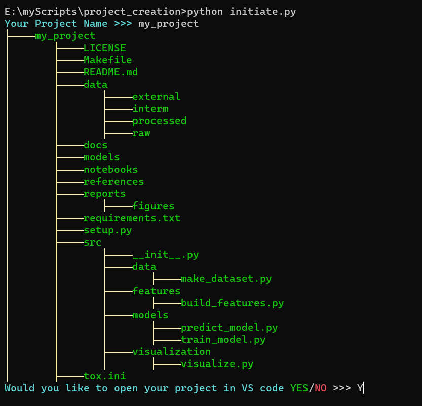
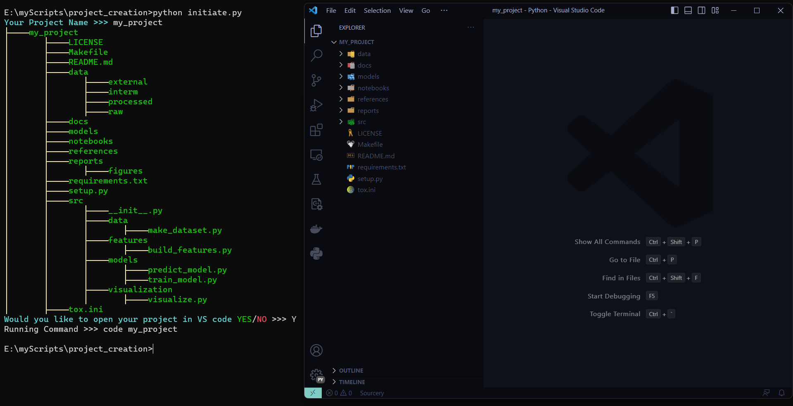

# AI / Data Science Project Initiator


This repo helps to create template for AI / Data Science project.


## Directory Structure


```
├── LICENSE
├── Makefile           <- Makefile with commands like `make data` or `make train`
├── README.md          <- The top-level README for developers using this project.
├── data
│   ├── external       <- Data from third party sources.
│   ├── interim        <- Intermediate data that has been transformed.
│   ├── processed      <- The final, canonical data sets for modeling.
│   └── raw            <- The original, immutable data dump.
│
├── docs               <- A default Sphinx project; see sphinx-doc.org for details
│
├── models             <- Trained and serialized models, model predictions, or model summaries
│
├── notebooks          <- Jupyter notebooks. Naming convention is a number (for ordering),
│                         the creator's initials, and a short `-` delimited description, e.g.
│                         `1.0-jqp-initial-data-exploration`.
│
├── references         <- Data dictionaries, manuals, and all other explanatory materials.
│
├── reports            <- Generated analysis as HTML, PDF, LaTeX, etc.
│   └── figures        <- Generated graphics and figures to be used in reporting
│
├── requirements.txt   <- The requirements file for reproducing the analysis environment, e.g.
│                         generated with `pip freeze > requirements.txt`
│
├── setup.py           <- Make this project pip installable with `pip install -e`
├── src                <- Source code for use in this project.
│   ├── __init__.py    <- Makes src a Python module
│   │
│   ├── data           <- Scripts to download or generate data
│   │   └── make_dataset.py
│   │
│   ├── features       <- Scripts to turn raw data into features for modeling
│   │   └── build_features.py
│   │
│   ├── models         <- Scripts to train models and then use trained models to make
│   │   │                 predictions
│   │   ├── predict_model.py
│   │   └── train_model.py
│   │
│   └── visualization  <- Scripts to create exploratory and results oriented visualizations
│       └── visualize.py
│
└── tox.ini            <- tox file with settings for running tox; see tox.readthedocs.io
```
<br>

For more customization, ```dir_struct``` dict can be modified as required in [initiate.py](initiate.py) file.


*Note: The ```dir_struct``` has naming conventions in order to seprate directories and files.*

- The Keys or Value strating with ```d-``` represents a directory.
- The Keys or Value strating with ```f-``` represents a directory.

```python
    dir_struct= {
    f"d-{DIR}": {
        "f-LICENSE": {},
        "f-Makefile": {},
        "f-README.md": {},
        "d-data": {
            "d-external": {}, 
            "d-interm": {}, 
            "d-processed": {}, 
            "d-raw": {}
            },
        "d-docs": {},
        "d-models": {},
        "d-notebooks": {},
        "d-references": {},
        "d-reports": {"d-figures": {}},
        "f-requirements.txt": {},
        "f-setup.py": {},
        "d-src": {
            "f-__init__.py": {},
            "d-data": {"f-make_dataset.py": {}},
            "d-features": {"f-build_features.py": {}},
            "d-models": {
                "f-predict_model.py": {}, 
                "f-train_model.py": {}
                },
            "d-visualization": {"f-visualize.py": {}},
        },
        "f-tox.ini": {},
    }
}
```


## Creating a Project

Clone this repo or download it, if required modify the directory structure in [initiate.py](initiate.py) file as suggested above.

```
python initiate.py
```
Provide your project name

```
Your Project Name >>> my_project
```
If VS Code is installed and you would like to open your project in it then type Y for yes or N for no.

```
Would you like to open your project in VS code YES/NO >>> Y
```

<center></center>
<br><br>
<center></center>

<br><br><br>

<div style='text-align: right;'>
    <sub>This directory structure used in this repo was inspired from 
    <a href="https://drivendata.github.io/cookiecutter-data-science/"> Cookiecutter Data Science</a>.</sup>
</div>

